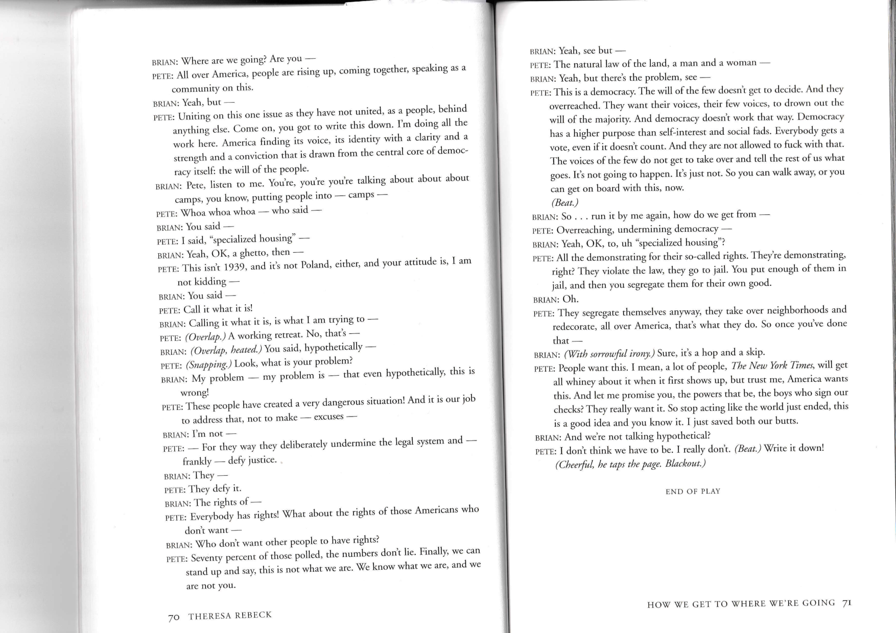

# Audition Assistant

Rehearse your lines with an AI voice partner — no scene partner required.



Upload a script PDF, pick your character, and the app reads every other character's lines aloud so you can focus on yours. Useful for cold readings, self-tape prep, or drilling a scene until it's muscle memory.

---

## Features

- **PDF upload** — drop in any script; scanned PDFs are handled via OCR
- **Automatic script parsing** — an LLM extracts characters and lines so you don't mark anything up manually
- **Character picker** — choose who you're playing; the app assigns distinct voices to everyone else
- **Voice rehearsal** — non-user lines are spoken aloud using neural TTS; your lines are captured by microphone
- **Script library** — upload up to 3 scripts, rename or delete them at any time
- **7 languages** — English (US + GB), Greek, Turkish, Dutch, Spanish, Portuguese

---

## Tech stack

| Layer | Technology |
|---|---|
| Frontend | Next.js + Tailwind, deployed on Vercel |
| Backend | FastAPI (Python), deployed on Render |
| Auth + Storage + DB | Supabase |
| Script parsing | Groq (Llama) or Anthropic (Claude), swappable via env var |
| OCR (scanned PDFs) | Groq Llama 4 Scout vision |
| TTS | Edge TTS (free, neural, server-side) |

---

## Local dev

```bash
# Backend (terminal 1)
make install-backend
cp backend/.env.example backend/.env      # fill in your keys
make dev-backend                           # → http://localhost:8000/health

# Frontend (terminal 2)
make install-frontend
cp tool-frontend/.env.local.example tool-frontend/.env.local
make dev-frontend                          # → http://localhost:3000
```

Keys you need:
- **Supabase** — project URL + service role key (backend) and anon key (frontend)
- **Groq** — for script parsing and OCR ([console.groq.com](https://console.groq.com))
- **Anthropic** — optional, only if you set `LLM_PROVIDER=anthropic`

---

## Repo layout

```
backend/         FastAPI — script ingestion, TTS generation, auth
tool-frontend/   Next.js — upload, setup, rehearsal UI
website/         Marketing site (empty for now)
.claude/         Architecture docs, decisions log, roadmap
```

---

## Docs

- [Architecture](.claude/ARCHITECTURE.md)
- [Decisions](.claude/DECISIONS.md)
- [Roadmap](.claude/ROADMAP.md)
- [Changelog](.claude/progress/CHANGELOG.md)
